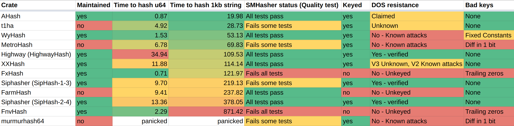

# Comparison with other hashers

## Design

AHash is designed *exclusively* for use in in-memory hashmaps. It does not have a fixed standard, but uses different
algorithms depending on the availability of hardware instructions. Whenever possible aHash uses the [hardware AES instruction](https://en.wikipedia.org/wiki/AES_instruction_set)
on X86 processors when it is available. If no specialized instructions are available, it falls back on an
[algorithm based on multiplication](https://github.com/tkaitchuck/aHash/wiki/AHash-fallback-algorithm)).

Because aHash does not have a fixed standard for its output, it can optimize its performance to a much greater extent than
algorithms which don't have this flexibility. This is great for Hashmaps but makes aHash inappropriate for applications where
a hash needs to be sent over the network, or persisted.

## Quality

**AHash passes the full [SMHasher test suite](https://github.com/rurban/smhasher)** both with and without AES support.
The output of the tests is checked into the [smhasher subdirectory](../smhasher). 

At **over 50GB/s** aHash is the fastest algorithm to pass the full test suite by more than a factor of 2. 
Even the fallback algorithm is in the top 5 in terms of throughput, beating out many other algorithms that rely on SSE and AVX instructions.

## Speed

aHash is the fastest non-trivial hasher implementation in Rust. Below is a comparison with 10 other popular hashing algorithms.  

## DOS resistance

AHash provides DOS resistance by incorporating random keys into the hash. There is a full explanation [here](https://github.com/tkaitchuck/aHash/wiki/How-aHash-is-resists-DOS-attacks).

If the `std` feature flag is enabled (On by default) it uses the `getrandom` crate to generate random seeds upon initialization.
If `std` is disabled and the `compile-time-rng` flag is enabled instead it will use the `const-random` to generate random seeds 
at compile time and embed them into the application binary.  

If neither `std` or `compile-time-rng` flags are enabled aHash will fall back on using the numeric value of memory addresses as a source of randomness.
This is somewhat strong if ALSR is turned on (it is by default in Rust) but for some platforms this is not available.
As a result this should not be relied on. For this reason it is strongly recommended that if you disable `std` because you program needs to run in a 
`no-std` environment to enable the `compile-time-rng` feature flag.

# Why use aHash over X

## SipHash

For a hashmap: Because aHash nearly **10x** faster.

SipHash is however useful in other contexts, such as for a HMAC, where aHash would be completely inappropriate.

*SipHash-2-4* is designed to provide DOS attack resistance, and has no presently known attacks
against this claim that doesn't involve learning bits of the key.

SipHash is also available in the "1-3" variant which is about twice as fast as the standard version.
The SipHash authors don't recommend using this variation when DOS attacks are a concern, but there are still no known
practical DOS attacks against the algorithm. Rust has opted for the "1-3" version as the  default in `std::collections::HashMap`,
because the speed trade off of "2-4" was not worth it.

As you can see in the graph above, aHash is **much** faster than even *SipHash-1-3*, and also provides DOS resistance.

## FxHash

In terms of performance, aHash is faster than the FXhash for strings and byte arrays but not primitives.
So it might seem like using Fxhash for hashmaps when the key is a primitive is a good idea. This is *not* the case.

When FX hash is operating on a 4 or 8 byte input such as a u32 or a u64, it reduces to multiplying the input by a fixed
constant. This is a bad hashing algorithm because it means that lower bits can never be influenced by any higher bit. In
the context of a hashmap where the low order bits are used to determine which bucket to put an item in, this isn't
any better than the identity function. Any keys that happen to end in the same bit pattern will all collide. 
Some examples of where this is likely to occur are:

* Strings encoded in base64
* Null terminated strings (when working with C code)
* Integers that have the lower bits as zeros. (IE any multiple of small power of 2, which isn't a rare pattern in computer programs.)  
  * For example when taking lengths of data or locations in data it is common for values to
have a multiple of 1024, if these were used as keys in a map they will collide and end up in the same bucket.

Like any non-keyed hash FxHash can be attacked. But FxHash is so prone to this that you may find yourself doing it accidentally.

For example, it is possible to [accidentally introduce quadratic behavior by reading from one map in iteration order and writing to another.](https://accidentallyquadratic.tumblr.com/post/153545455987/rust-hash-iteration-reinsertion)

Fxhash flaws make sense when you understand it for what it is. It is a quick and dirty hash, nothing more.
it was not published and promoted by its creator, it was **found**!

Because it is error-prone, FxHash should never be used as a default. In specialized instances where the keys are understood
it makes sense, but given that aHash is faster on almost any object, it's probably not worth it.

## FnvHash

FnvHash is also a poor default. It only handles one byte at a time, so its performance really suffers with large inputs.
It is also non-keyed so it is still subject to DOS attacks and [accidentally quadratic behavior.](https://accidentallyquadratic.tumblr.com/post/153545455987/rust-hash-iteration-reinsertion)

## MurmurHash, CityHash, MetroHash, FarmHash, and HighwayHash

Murmur, City, Metro, Farm and Highway are all related, and appear to directly replace one another.

They are all fine hashing algorithms, they do a good job of scrambling data, but they are all targeted at a different
usecase. They are intended to work in distributed systems where the hash is expected to be the same over time and from one
computer to the next, efficiently hashing large volumes of data.

This is quite different from the needs of a Hasher used in a hashmap. In a map the typical value is under 10 bytes. None
of these algorithms scale down to handle that small of data at a competitive time. What's more the restriction that they
provide consistent output prevents them from taking advantage of different hardware capabilities on different CPUs. It makes
sense for a hashmap to work differently on a phone than on a server, or in WASM.

If you need to persist or transmit a hash of a file, then using one of these is probably a good idea. 
HighwayHash seems to be the preferred solution as it offers high throughput for large objects and is DOS resistant.

## t1ha and XXHash
Like aHash, t1ha and XXHash are targeted at hashmaps and uses hardware instructions including AES for different platforms rather than having a single standard.
Both are fast, but AHash is faster than either one, both with and without AES. This is particularly true of smaller inputs such as integers.
T1ha's hashes do not pass the full of the SMHasher test suite.

Neither XXHash nor T1ha explicitly claim DOS resistance, but both are keyed hashes, and do not have any obvious way to force collisions.
As of this writing there doesn't appear to be a maintained crate implementing the latest version of t1ha.

## wyHash
Similarly, wyHash is targeted at hashmaps. WyHash is quite fast, but is not DOS resistant. 

There are fixed strings which when encountered caused the internal state to reset. This makes wyHash trivial to attack.

AHash outperforms wyHash across all input sizes, regardless of which CPU instructions are available. 